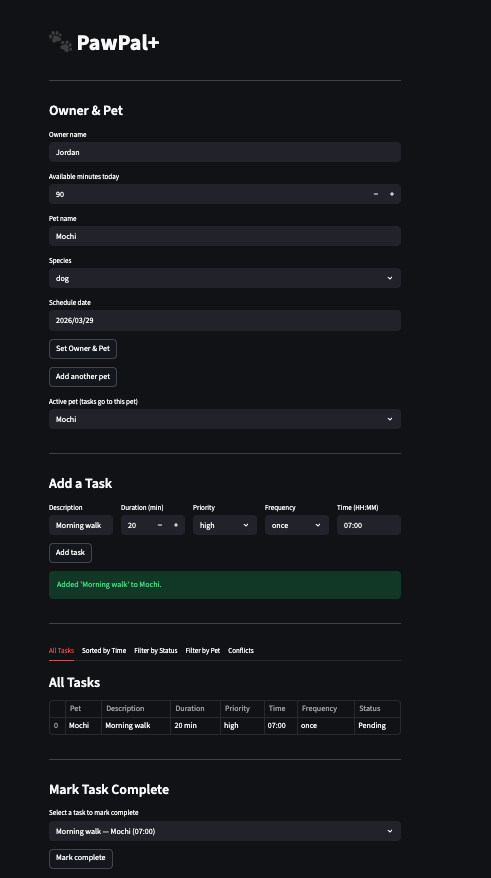

# PawPal+ (Module 2 Project)

You are building **PawPal+**, a Streamlit app that helps a pet owner plan care tasks for their pet.

## Scenario

A busy pet owner needs help staying consistent with pet care. They want an assistant that can:

- Track pet care tasks (walks, feeding, meds, enrichment, grooming, etc.)
- Consider constraints (time available, priority, owner preferences)
- Produce a daily plan and explain why it chose that plan

Your job is to design the system first (UML), then implement the logic in Python, then connect it to the Streamlit UI.

## What you will build

Your final app should:

- Let a user enter basic owner + pet info
- Let a user add/edit tasks (duration + priority at minimum)
- Generate a daily schedule/plan based on constraints and priorities
- Display the plan clearly (and ideally explain the reasoning)
- Include tests for the most important scheduling behaviors

## Smarter Scheduling

The following features were added to `pawpal_system.py` to make the scheduler more useful for a real pet owner:

### Sort by Time
`Scheduler.sort_by_time()` returns pending tasks in chronological order using Python's `sorted()` with a `lambda` key on the `task.time` field (`"HH:MM"` format). Because times are zero-padded strings, lexicographic order matches chronological order — no conversion needed.

### Filter by Status
`Scheduler.filter_by_status(completed: bool)` lets the owner view either pending or completed tasks across all pets and all dates. Pass `True` for done tasks, `False` for what still needs attention.

### Filter by Pet
`Scheduler.filter_by_pet(pet_name: str)` returns every task belonging to a named pet, using case-insensitive matching. Useful for reviewing one pet's full care history at a glance.

### Conflict Detection
`Scheduler.detect_conflicts()` scans all tasks and warns when two tasks share the same date and time slot — whether they belong to the same pet or different pets. Uses a `defaultdict(list)` to group tasks by `(date, time)` key for efficient lookup. Always returns a list of warning strings and never raises an exception.

### Auto-Rescheduling
`Task.next_occurrence()` computes the next due date for recurring tasks using Python's `timedelta`:
- `"daily"` → current date + 1 day
- `"weekly"` → current date + 7 days
- `"once"` → returns `None` (not rescheduled)

`Scheduler.mark_task_complete()` calls this automatically when a task is marked done, appending the new instance to the correct pet's task list so recurring care never falls off the schedule.

## Features

### Priority-Based Scheduling
Tasks are sorted by priority (high → medium → low) and greedily added to the plan until the owner's available time budget is exhausted. High-priority tasks are always considered first, ensuring the most important care never gets dropped.

### Time Budget Enforcement
The scheduler tracks cumulative task duration and stops adding tasks once the owner's available minutes are used up. Tasks that individually fit but would exceed the budget are skipped.

### Sorting by Time
Pending tasks can be viewed in chronological order using `sort_by_time()`. Tasks use a zero-padded `"HH:MM"` time field, which sorts correctly as plain strings without any conversion.

### Conflict Detection
`detect_conflicts()` scans all tasks across all pets and flags any two tasks that share the same date and time slot. Conflicts are returned as warning strings so the owner can reschedule before the day starts.

### Daily and Weekly Recurrence
`Task.next_occurrence()` auto-generates the next instance of a recurring task using Python's `timedelta` — +1 day for daily, +7 days for weekly. One-time tasks return `None` and are not rescheduled.

### Auto-Rescheduling on Completion
When `mark_task_complete()` is called on a recurring task, the next occurrence is automatically created and added to the pet's task list so recurring care never falls off the schedule.

### Filter by Status
Tasks across all pets can be filtered to show only pending or only completed items, making it easy to review what still needs attention vs. what's already done.

### Filter by Pet
`filter_by_pet(pet_name)` returns all tasks for a specific pet using case-insensitive name matching, useful for reviewing one pet's full care list at a glance.

### Multi-Pet Support
An owner can have multiple pets, each with their own task list. The scheduler aggregates tasks across all pets when generating a plan or detecting conflicts.

---

## Getting started

## Testing PawPal
To run test use this command: ``` python3 -m pytest  ``` 
There are a lot of tests but they cover:
    - Adding tasks and marking them as complete
    - Testing reoccuring tasks and making sure that they function as expected
    - Making sure high priority tasks are scheduled before low priority tasks and that task adding logic works as expected
    - Ensuring the tasks are returned in time based order
    - The filtering for pets and status both work
    - The conflict detection works.
    Based on all these tests I would give it a 4 star confidence rating, it passed all tests but I am sure there could be some random edge cases.

### Setup

```bash
python -m venv .venv
source .venv/bin/activate  # Windows: .venv\Scripts\activate
pip install -r requirements.txt
```

### Suggested workflow

1. Read the scenario carefully and identify requirements and edge cases.
2. Draft a UML diagram (classes, attributes, methods, relationships).
3. Convert UML into Python class stubs (no logic yet).
4. Implement scheduling logic in small increments.
5. Add tests to verify key behaviors.
6. Connect your logic to the Streamlit UI in `app.py`.
7. Refine UML so it matches what you actually built.

---

## Final App


